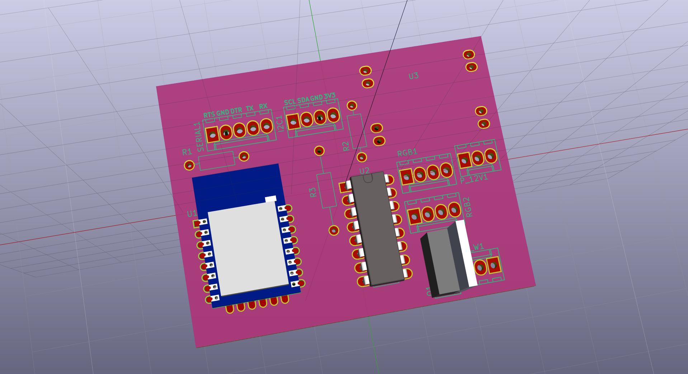

# ESP-LEDCtrl
LED Strip Controller (2x RGB, 1 White) with ESP8266 Homie (MQTT).
Display support (SSD1306 OLED) is work in progress.

## How to Build
  * If not already installed, install Platformio
    * See http://docs.platformio.org/en/latest/installation.html for instructions
    
  * Clone LEDCtrl + necessary libraries into a directory
    * `git clone https://github.com/euphi/ESP-LEDCtrl.git`
    * `git clone https://github.com/marvinroger/homie-esp8266.git`
    * `git clone https://github.com/euphi/HomieNodeCollection.git`
    * `git clone https://github.com/euphi/esp8266-oled-ssd1306.git`
    
  * Link libs into the ESP-LEDCtrl lib directory:
    * `cd ESP-LEDCtrl/lib`
    * `ln -s ../../homie-esp8266 .`
    * `ln -s ../../HomieNodeCollection .`
    * `ln -s ../../esp8266-oled-ssd1306 .`
    * `cd ..`
  
  * Run platformio
    * Ensure working directory is ESP-LEDCtrl and run `pio run` 
    * To upload, use `pio run --target upload`
    
## Outlook
  * Display support
  * touch controller support
  * Support for "set temperature", so it can be used as thermostat.

## Hardware
  * There is a kicad project with a PCB for two RGB outputs and one white channel in the [PCB subdirectory](doc/PCB)
  * 
  * This PCB does not use any SMD parts, so it can easily be built and soldered at home (I created and etched  it with "toner transfer", then soldered the parts).
  * The RGB output uses an ULN2003A as amplifier. This is a Bipolar device with limited power, so don't drive LED strips with it without an RGB signal amplifier.
    * Example signal amplifier on [Amazon](https://www.amazon.de/gp/product/B00E4GVUMS)

  * The white channel uses a FET as driver, so you can drive white LED strips.
  * I2C is available on board. Till now, I used it to connect a HTU21 temperature+humidity sensor to it. I will add a touch controller to control the LEDs locally.
  * Serial Programming Interface available. Auto-Reset into flash mode possible with esptool / platformio using the "ck"-reset method (Connect DTR to GPIO0, RTS to Reset)
  * BOM:
    * ESP-12F (Ai-Thinker) (or ESP-12E)
    * ULN 2003
    * P16NF06L
    * DCDC-Converter (Adjustable, set to 12V -> 3,3V) (DAOKAI® 10PCS Standard Stromversorgungsmodul Adjustable Step down 3A DC DC Converter 1pc New)
    * 3x 1/4 W Resistor (Pull-Up/Down; I used 3,16kΩ)
    * Molex 4 Pin Connectors
    * Molex 3 Pin Connectors
    * 2mm Pin-Header to solder the ESP-12E
    * 2,54mm Pin-Header for Serial/Programming interface (use "ck"-Reset method for esptool).
